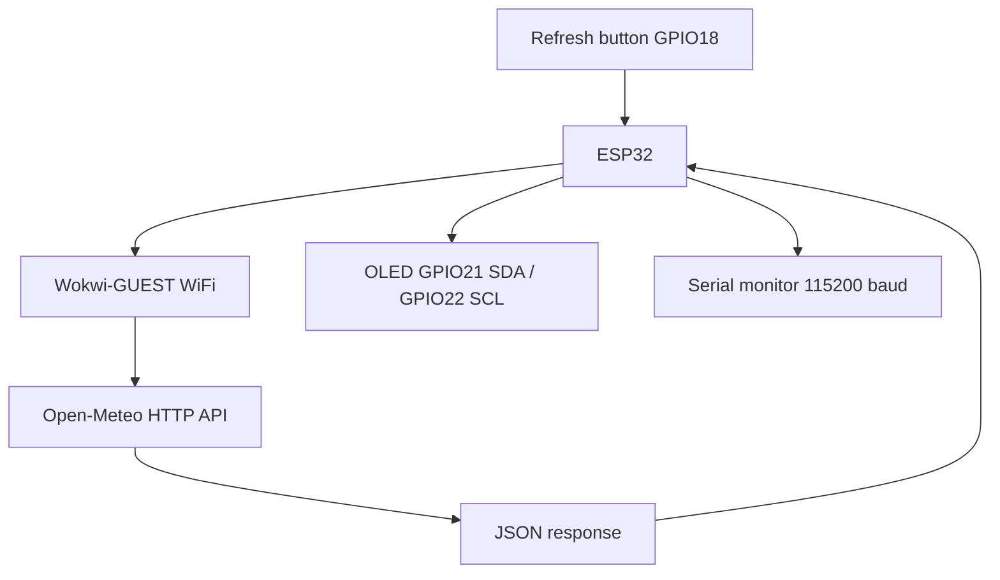
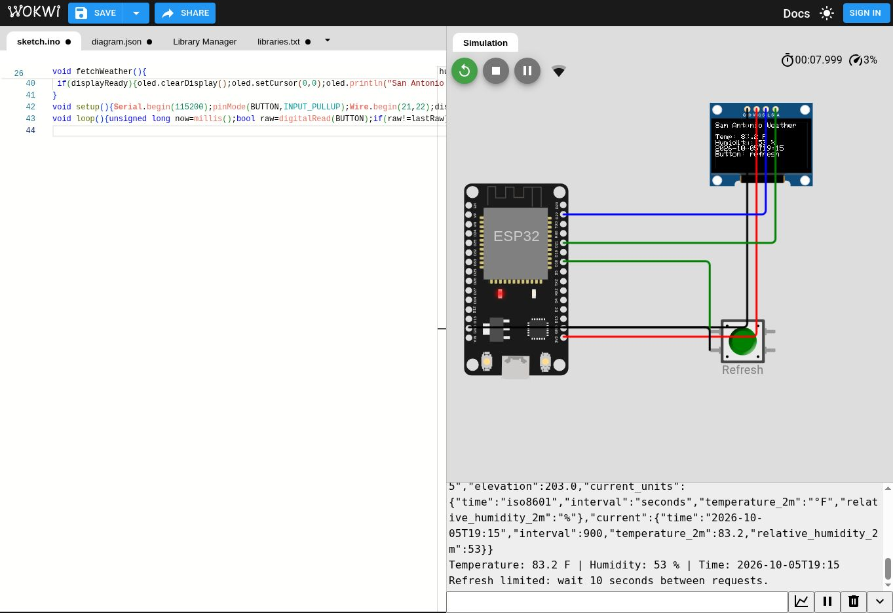

# San Antonio Internet Weather Display
**Student:** Jacob Kebbel  
**Course:** ENGR 4399 ST: Cyber-Physical & IoT Systems  
**Assignment:** Simulation 3 — ESP32 WiFi, APIs, and Cloud Data

## Overview
An ESP32 retrieves San Antonio weather from Open-Meteo and displays temperature (F), relative humidity (%), and the API timestamp on a 128×64 SSD1306 OLED. A pushbutton requests a refresh. This adapts the SunFounder IoT Internet Weather Station concept, using a keyless public API instead of OpenWeatherMap.

## System block diagram


## Files
- `sketch.ino`: full Arduino firmware
- `diagram.json`: Wokwi circuit and pin assignments
- `libraries.txt`: ArduinoJson, Adafruit GFX Library, Adafruit SSD1306
- `evidence/`: captured Wokwi screenshots and verification notes when available

## Wiring
| ESP32 | Component | Purpose |
| --- | --- | --- |
| 3V3 | OLED VCC | Power |
| GND | OLED GND | Common ground |
| GPIO21 | OLED SDA | I2C data |
| GPIO22 | OLED SCL | I2C clock |
| GPIO18 | Button terminal 1 | Active-low input with internal pull-up |
| GND | Button terminal 2 | Ground when pressed |

## WiFi and API interaction
`WiFi.begin("Wokwi-GUEST", "", 6)` connects to the simulator network without a password. HTTPClient sends GET to:

```text
http://api.open-meteo.com/v1/forecast?latitude=29.4241&longitude=-98.4936&current=temperature_2m,relative_humidity_2m&temperature_unit=fahrenheit&timezone=America%2FChicago
```
ArduinoJson parses `current.temperature_2m`, `current.relative_humidity_2m`, and `current.time`. The firmware checks HTTP status, JSON validity, field types, and missing timestamps. WiFi connection and HTTP request timeouts prevent indefinite blocking. HTTP is an educational simplification; a physical deployment should use HTTPS with trusted certificate validation.

## Run in Wokwi
1. Create an ESP32 Arduino project at https://wokwi.com/projects/new/esp32.
2. Replace `sketch.ino` and `diagram.json` with these files; add `libraries.txt` with the supplied dependencies.
3. Press Play. Observe WiFi, HTTP status, raw JSON, and parsed weather in Serial Monitor.
4. Check the OLED, then press Refresh after at least 10 seconds.
5. Automatic updates occur every 60 seconds. The button uses 40 ms software debounce and a 10-second request limit.
6. Save the project (sign in if prompted), and copy its permanent project URL into the report and this README.

**Permanent Wokwi URL:** pending Wokwi account sign-in and save. The new-project URL above is a launch page, not a saved simulation link.



## GitHub publication
Create a **public** repository named `ENGR4399-ESP32-WiFiAssignment`, upload this folder's files to the repository root, and copy the actual repository URL into the report. The student will publish the repository. See `GITHUB_UPLOAD.md` for exact steps; no published repository is claimed in this package.

## Verification
See `evidence/verification.md`. Only observed results are marked Pass. Unperformed fault-injection tests are identified as pending.

## References
- SunFounder: https://docs.sunfounder.com/projects/esp32-starter-kit/en/latest/arduino_video_course/video_43_open_weather.html
- Wokwi ESP32 WiFi: https://docs.wokwi.com/guides/esp32-wifi
- Wokwi OLED: https://docs.wokwi.com/parts/board-ssd1306
- Open-Meteo: https://open-meteo.com/en/docs
- ArduinoJson: https://arduinojson.org/v7/api/json/deserializejson/
- Adafruit SSD1306: https://github.com/adafruit/Adafruit_SSD1306

## Attribution
Code and documentation prepared with ChatGPT assistance. Review the implementation and complete any pending verification before submission.
